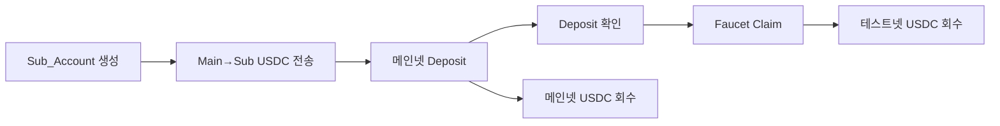
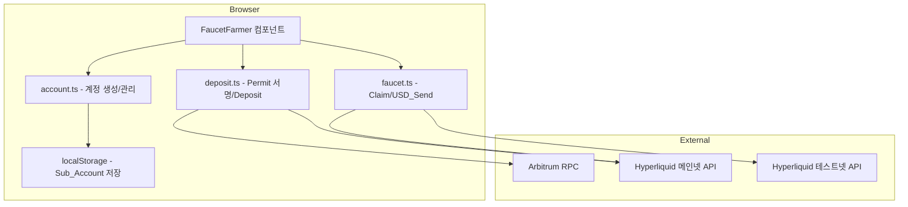
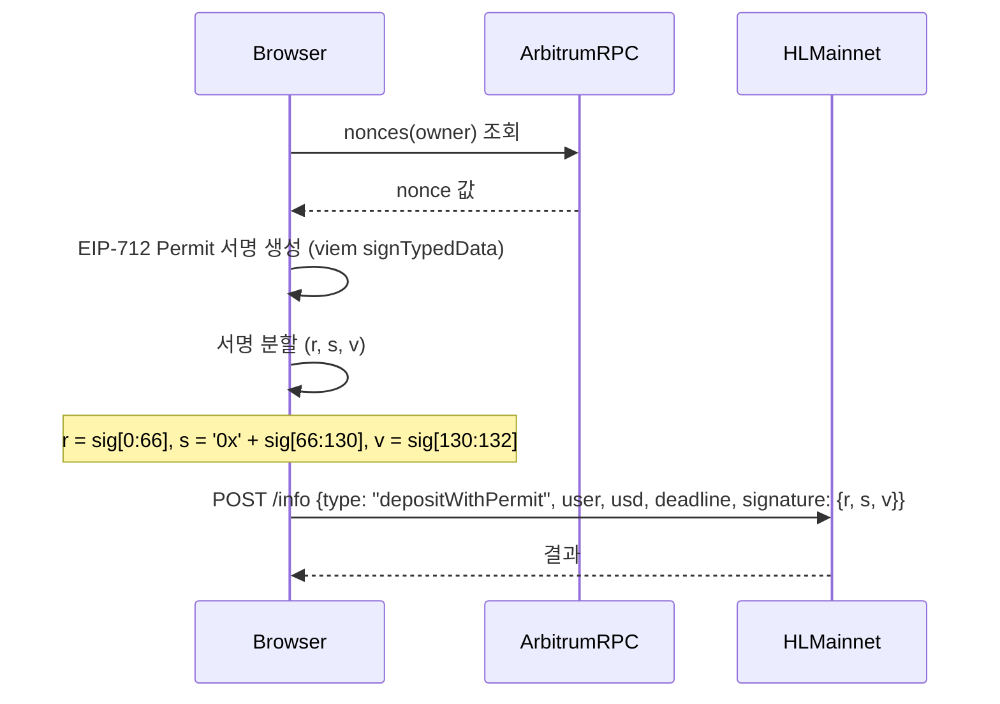
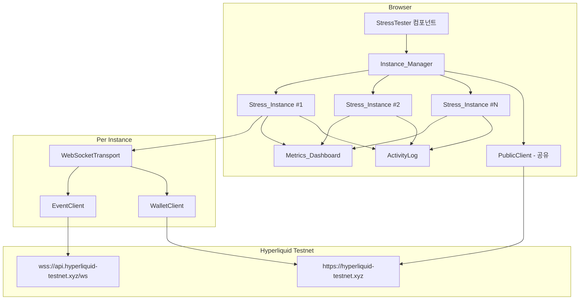
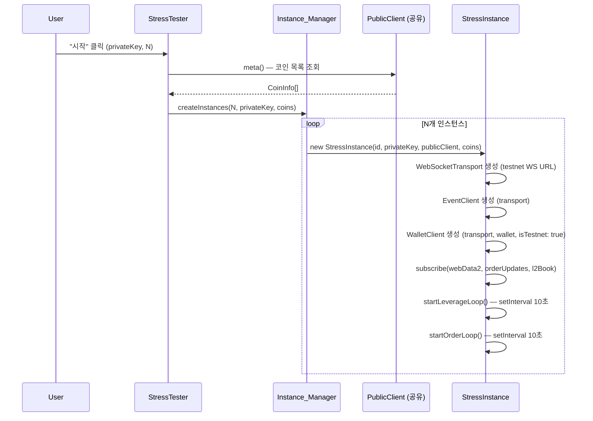
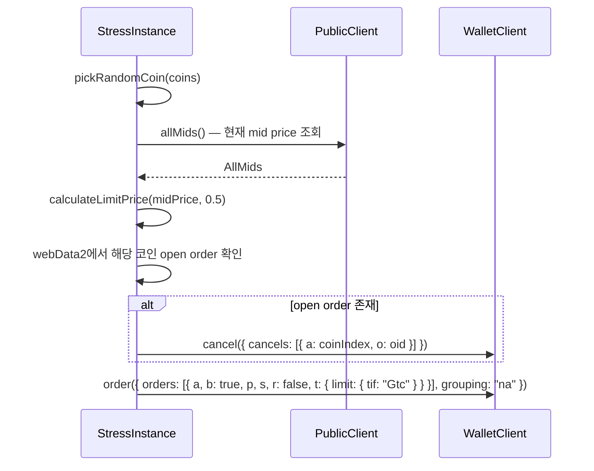
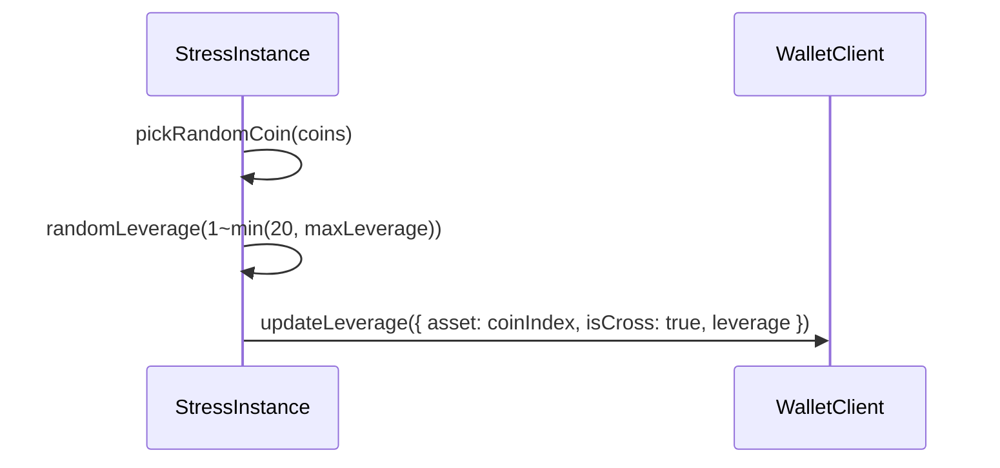

# 설계 문서: Supercycl Toolkit

## 개요

Supercycl Toolkit은 코인 선물거래 애그리게이터 Supercycl 개발 과정에서 필요한 테스트/유틸리티 도구를 모아놓은 Next.js 기반 웹 애플리케이션이다.

핵심 설계 원칙:

- **설정 기반 확장**: 새 도구 추가 시 설정 파일에 항목만 추가하면 메뉴와 라우팅이 자동 반영
- **클라이언트 직접 호출**: 브라우저에서 외부 API로 직접 요청 (서버 프록시 없음)

### 기술 스택

| 구분            | 선택                   | 이유                                                         |
| --------------- | ---------------------- | ------------------------------------------------------------ |
| 프레임워크      | Next.js 14+ App Router | 파일 기반 라우팅, SSG 지원                                   |
| 언어            | TypeScript             | 타입 안전성                                                  |
| 스타일링        | Tailwind CSS           | 빠른 UI 구성                                                 |
| API 호출        | fetch API              | 브라우저 내장, 추가 의존성 없음                              |
| 상태 관리       | React useState/useRef  | 단일 페이지 내 상태, 전역 상태 불필요                        |
| 블록체인        | viem                   | Arbitrum 체인 상호작용 (계정 생성, ERC-20 전송, Permit 서명) |
| Hyperliquid SDK | hyperliquid (npm)      | usdSend 등 exchange API 호출. 브라우저 호환                  |

---

## 1. 공통 설계

### 1.1 라우팅 구조

```
app/
├── layout.tsx          # 사이드바 포함 공통 레이아웃
├── page.tsx            # 루트 → 첫 번째 도구로 리다이렉트
└── tools/
    └── [slug]/
        └── page.tsx    # 동적 라우트: 도구별 페이지
```

동적 라우트 `[slug]`를 사용하여 설정 파일의 slug와 매칭한다. 설정에 없는 slug 접근 시 404를 반환한다.

### 1.2 설정 파일 구조

도구 등록은 `src/config/tools.ts`에서 관리한다:

```typescript
export interface ToolConfig {
  slug: string; // URL 경로 (예: "rate-limit-tester")
  name: string; // 메뉴 표시명 (예: "HL Rate-Limit Tester")
  description: string; // Tool_Page 상단 설명
  icon?: string; // 선택적 아이콘
}

export const tools: ToolConfig[] = [
  {
    slug: "hl-rate-limit-tester",
    name: "HL Rate-Limit Tester",
    description:
      "Hyperliquid API의 IP 기반 rate-limit(분당 weight 1200)이 실제로 어느 시점에 발동되는지 확인하는 도구입니다...",
  },
  // 새 도구 추가 시 여기에 항목 추가
];
```

새 도구 추가 절차:

1. `tools` 배열에 `ToolConfig` 항목 추가
2. `app/tools/[slug]/page.tsx`에서 해당 slug에 대한 컴포넌트 매핑 추가

### 1.3 공통 컴포넌트

```typescript
// Sidebar: 메뉴 설정을 읽어 메뉴 항목 렌더링
interface SidebarProps {
  tools: ToolConfig[];
  currentSlug: string;
}

// ToolHeader: 현재 도구의 설명 표시
interface ToolHeaderProps {
  tool: ToolConfig;
}
```

---

## 2. Hyperliquid Rate-Limit 확인

### 2.1 컴포넌트 구조

```typescript
// AddressInput: 이더리움 주소 입력 및 검증
interface AddressInputProps {
  value: string;
  onChange: (value: string) => void;
  error: string | null;
  disabled: boolean;
}

// TestControls: 시작/중단 버튼
interface TestControlsProps {
  onStart: () => void;
  onStop: () => void;
  isRunning: boolean;
  canStart: boolean;
}

// LiveStatus: 실시간 진행 현황
interface LiveStatusProps {
  requestCount: number;
  totalWeight: number;
  elapsedTime: number;
  weightLimit: number;
}

// TestSummary: 테스트 완료 후 요약
interface TestSummaryProps {
  summary: TestSessionSummary | null;
}

// RequestLog: 요청 로그 테이블
interface RequestLogProps {
  logs: RequestLogEntry[];
}
```

### 2.2 데이터 모델

```typescript
interface RequestLogEntry {
  requestNumber: number;
  timestamp: string;
  statusCode: number;
  responseTimeMs: number;
  itemCount: number;
  weight: number;
  error?: string;
}

interface TestSessionSummary {
  totalRequests: number;
  totalWeight: number;
  rateLimitReached: boolean;
  elapsedTimeMs: number;
  retryAfter?: number;
  errorMessage?: string;
}

interface ApiResponse {
  statusCode: number;
  data: any[];
  responseTimeMs: number;
  headers: Record<string, string>;
  error?: string;
}

interface TestState {
  status: "idle" | "running" | "completed" | "stopped";
  address: string;
  addressError: string | null;
  logs: RequestLogEntry[];
  summary: TestSessionSummary | null;
  startedAt: number | null;
}
```

### 2.3 핵심 로직

```typescript
// src/lib/hyperliquid.ts

const ADDRESS_REGEX = /^0x[0-9a-fA-F]{40}$/;
function validateAddress(address: string): string | null

async function callUserFillsByTime(
  address: string, startTime: number, endTime: number, signal?: AbortSignal
): Promise<ApiResponse>

function calculateWeight(itemCount: number): number {
  const baseWeight = 20;
  const additionalWeight = Math.floor(itemCount / 20);
  return baseWeight + additionalWeight;
}

async function* runTestSession(
  address: string, signal: AbortSignal
): AsyncGenerator<RequestLogEntry>
```

테스트 실행 흐름:

1. `startTime` = 현재 시각 - 24시간, `endTime` = 현재 시각 (ms 타임스탬프)
2. 루프: `callUserFillsByTime` 호출 → 결과 yield → weight 누적
3. HTTP 429 수신 시 루프 종료, Retry-After 헤더 추출
4. AbortSignal로 사용자 중단 처리

### 2.4 에러 처리

| 에러 상황                     | 처리 방식                                                    |
| ----------------------------- | ------------------------------------------------------------ |
| 유효하지 않은 주소 입력       | 입력 필드 아래에 에러 메시지 표시, 시작 버튼 비활성화        |
| 네트워크 오류 (fetch 실패)    | 로그에 에러 기록, 테스트 중단, 요약에 에러 메시지 포함       |
| HTTP 429 (Rate Limit)         | 정상 종료 경로: 테스트 중단, Retry-After 및 에러 메시지 추출 |
| HTTP 4xx/5xx (기타)           | 로그에 상태 코드와 에러 기록, 테스트 계속 진행               |
| 사용자 중단 (AbortController) | AbortError 캐치, 현재까지의 결과로 요약 생성                 |

---

## 3. HL Testnet Faucet Farmer

### 3.1 개요

Faucet Farmer는 Hyperliquid 테스트넷에서 USDC를 대량 확보하기 위한 자동화 도구이다. Hyperliquid 테스트넷 faucet은 계정당 1회 claim만 허용하므로, 여러 Sub_Account를 생성하여 각각 faucet claim을 수행한 뒤 테스트넷 USDC를 Main_Account로 회수하는 전체 파이프라인을 제공한다.

전체 흐름:



핵심 설계 원칙:

- **클라이언트 사이드 전용**: 모든 암호화 연산과 서명이 브라우저에서 수행됨. 서버 API 라우트 불필요
- **단계별 독립 실행**: 각 단계를 개별 버튼으로 실행 가능하여 에러 복구가 용이
- **세션 기반 계정 관리**: 새 계정 생성 시 기존 계정을 교체하되, 반드시 백업을 먼저 수행

### 3.2 아키텍처



기존 Rate-Limit Tester와 동일한 패턴을 따른다:

- `src/config/tools.ts`에 도구 등록
- `src/app/tools/[slug]/page.tsx`에서 slug 매핑
- 도구별 컴포넌트는 `src/components/faucet-farmer/` 하위에 배치
- 비즈니스 로직은 `src/lib/faucet/` 하위에 배치

### 3.3 컴포넌트 및 인터페이스

#### 3.3.1 페이지 컴포넌트 구조

```
src/components/faucet-farmer/
├── FaucetFarmer.tsx          # 메인 컨테이너 (상태 관리, 단계 오케스트레이션)
├── SecurityWarning.tsx       # 보안 경고 배너
├── SubAccountManager.tsx     # 계정 생성/표시/백업/복원
├── MainAccountInput.tsx      # Main_Account 입력 및 잔액 표시
├── StepPanel.tsx             # 개별 단계 실행 패널 (공통)
└── AccountStatusTable.tsx    # Sub_Account별 상태 테이블 (공통)
```

#### 3.3.2 컴포넌트 인터페이스

```typescript
// SecurityWarning: 보안 경고 상시 표시
// props 없음 — 정적 경고 메시지

// SubAccountManager: 계정 생성, 목록 표시, 백업/복원
interface SubAccountManagerProps {
  accounts: SubAccount[];
  onGenerate: (count: number) => void;
  onRestore: (file: File) => void;
  onDownloadBackup: () => void;
}

// MainAccountInput: Main_Account private key 입력 및 잔액 표시
interface MainAccountInputProps {
  onAccountSet: (account: MainAccountInfo) => void;
  subAccountCount: number;
}

// StepPanel: 각 단계의 실행 버튼 + 진행 상태
interface StepPanelProps {
  title: string;
  description: string;
  onExecute: () => void;
  disabled: boolean;
  isRunning: boolean;
  summary?: StepSummary;
}

// AccountStatusTable: Sub_Account별 상태 표시 테이블
interface AccountStatusTableProps {
  accounts: SubAccount[];
  statuses: Map<string, AccountStepStatus>;
  showAmount?: boolean;
}
```

#### 3.3.3 라이브러리 모듈 구조

```
src/lib/faucet/
├── account.ts      # 계정 생성, localStorage 관리, JSON 백업/복원
├── balance.ts      # USDC/ETH 잔액 조회
├── transfer.ts     # ERC-20 USDC 전송 (Main→Sub)
├── deposit.ts      # DepositWithPermit 서명 및 제출
├── faucet.ts       # Faucet claim, USD_Send
└── constants.ts    # 상수 (주소, ABI, URL 등)
```

```typescript
// src/lib/faucet/constants.ts
export const USDC_CONTRACT =
  "0xaf88d065e77c8cc2239327c5edb3a432268e5831" as const;
export const BRIDGE_ADDRESS =
  "0x2df1c51e09aecf9cacb7bc98cb1742757f163df7" as const;
export const ARBITRUM_RPC = "https://arb1.arbitrum.io/rpc" as const;
export const MAINNET_INFO_API = "https://api.hyperliquid.xyz/info" as const;
export const MAINNET_EXCHANGE_API =
  "https://api.hyperliquid.xyz/exchange" as const;
export const TESTNET_INFO_API =
  "https://api.hyperliquid-testnet.xyz/info" as const;
export const TESTNET_EXCHANGE_API =
  "https://api.hyperliquid-testnet.xyz/exchange" as const;
export const DEPOSIT_API = "https://api-ui.hyperliquid.xyz/info" as const; // depositWithPermit 전용
export const FAUCET_API =
  "https://api-ui.hyperliquid-testnet.xyz/info" as const; // claimDrip 전용
export const USDC_DECIMALS = 6;
export const DEPOSIT_AMOUNT_USD = 5; // deposit할 USDC 금액
export const TRANSFER_AMOUNT_USD = 5.5; // Main→Sub 전송 금액 (deposit + 여유분)

export const PERMIT_DOMAIN = {
  name: "USD Coin",
  version: "2",
  chainId: 42161,
  verifyingContract: USDC_CONTRACT,
} as const;

export const PERMIT_TYPES = {
  Permit: [
    { name: "owner", type: "address" },
    { name: "spender", type: "address" },
    { name: "value", type: "uint256" },
    { name: "nonce", type: "uint256" },
    { name: "deadline", type: "uint256" },
  ],
} as const;

// ERC-20 최소 ABI (transfer, balanceOf, nonces, approve)
export const USDC_ABI = [
  "function balanceOf(address) view returns (uint256)",
  "function transfer(address to, uint256 amount) returns (bool)",
  "function nonces(address owner) view returns (uint256)",
  "function approve(address spender, uint256 amount) returns (bool)",
] as const;
```

```typescript
// src/lib/faucet/account.ts
import { generatePrivateKey, privateKeyToAccount } from "viem/accounts";

const STORAGE_KEY = "faucet-farmer-sub-accounts";

function generateSubAccounts(count: number): SubAccount[];
function saveToLocalStorage(accounts: SubAccount[]): void;
function loadFromLocalStorage(): SubAccount[];
function exportToJson(accounts: SubAccount[]): string;
function importFromJson(json: string): SubAccount[];
function downloadBackup(accounts: SubAccount[]): void;
```

```typescript
// src/lib/faucet/balance.ts
import { createPublicClient, http, formatUnits, formatEther } from "viem";
import { arbitrum } from "viem/chains";

async function getUsdcBalance(address: string): Promise<bigint>;
async function getEthBalance(address: string): Promise<bigint>;
async function getHyperliquidBalance(
  address: string,
  isTestnet: boolean,
): Promise<string>;
```

```typescript
// src/lib/faucet/transfer.ts
import { createWalletClient, http, parseUnits } from "viem";
import { arbitrum } from "viem/chains";

async function transferUsdc(
  privateKey: string,
  toAddress: string,
  amountUsd: number,
): Promise<{ txHash: string }>;
```

```typescript
// src/lib/faucet/deposit.ts

// EIP-2612 Permit 서명 생성
async function signPermit(
  privateKey: string,
  owner: string,
  value: bigint,
  nonce: bigint,
  deadline: bigint,
): Promise<{ r: string; s: string; v: number }>;

// Hyperliquid depositWithPermit API 호출
async function submitDeposit(
  user: string,
  usd: string,
  deadline: number,
  signature: { r: string; s: string; v: number },
): Promise<{ success: boolean; error?: string }>;
```

```typescript
// src/lib/faucet/faucet.ts
import { Hyperliquid } from "hyperliquid";

// 테스트넷 faucet claim (직접 fetch — SDK에 없는 기능)
async function claimFaucet(
  address: string,
): Promise<{ success: boolean; error?: string }>;

// USD_Send — Hyperliquid SDK 사용
async function sendUsd(
  privateKey: string,
  destination: string,
  amount: string,
  isTestnet: boolean,
): Promise<{ success: boolean; error?: string }>;
// 내부 구현:
// const sdk = new Hyperliquid({ privateKey, testnet: isTestnet });
// await sdk.exchange.usdClassSend(destination, amount);
```

### 3.4 데이터 모델

```typescript
// src/types/faucet.ts

/** Sub_Account 정보 */
interface SubAccount {
  address: string; // 0x... Arbitrum 주소
  privateKey: string; // 0x... private key
  createdAt: string; // ISO 8601 생성 시각
}

/** Main_Account 정보 (private key는 메모리에만 보관) */
interface MainAccountInfo {
  address: string;
  privateKey: string; // 메모리 전용, localStorage 저장 안 함
  usdcBalance: string; // 포맷된 USDC 잔액 (예: "100.50")
  ethBalance: string; // 포맷된 ETH 잔액 (예: "0.001234")
}

/** 각 Sub_Account의 단계별 실행 상태 */
type AccountStepStatusType =
  | "idle"
  | "pending"
  | "running"
  | "success"
  | "failed";

interface AccountStepStatus {
  status: AccountStepStatusType;
  txHash?: string; // 성공 시 트랜잭션 해시
  error?: string; // 실패 시 에러 메시지
  amount?: string; // 회수 금액 등
}

/** 단계 실행 요약 */
interface StepSummary {
  total: number;
  success: number;
  failed: number;
  totalAmount?: string; // 회수 단계에서 총 금액
}

/** Faucet Farmer 전체 상태 */
interface FaucetFarmerState {
  subAccounts: SubAccount[];
  mainAccount: MainAccountInfo | null;
  currentStep: FarmerStep | null;
  stepStatuses: Record<FarmerStep, Map<string, AccountStepStatus>>;
  stepSummaries: Record<FarmerStep, StepSummary | null>;
}

/** 실행 단계 열거 */
type FarmerStep =
  | "transfer" // Main→Sub USDC 전송
  | "deposit" // 메인넷 Deposit
  | "depositCheck" // Deposit 확인
  | "faucetClaim" // 테스트넷 Faucet Claim
  | "testnetRecover" // 테스트넷 USDC 회수
  | "mainnetRecover"; // 메인넷 USDC 회수

/** Permit 서명 결과 */
interface PermitSignature {
  r: string;
  s: string;
  v: number;
}

/** JSON 백업 파일 형식 */
interface AccountBackup {
  version: 1;
  exportedAt: string; // ISO 8601
  accounts: SubAccount[];
}
```

#### 3.4.1 localStorage 스키마

| 키                           | 값 형식             | 설명             |
| ---------------------------- | ------------------- | ---------------- |
| `faucet-farmer-sub-accounts` | `SubAccount[]` JSON | Sub_Account 목록 |

Main_Account의 private key는 localStorage에 저장하지 않는다. 페이지 새로고침 시 재입력이 필요하다.

#### 3.4.2 JSON 백업 파일 형식

```json
{
  "version": 1,
  "exportedAt": "2024-01-15T10:30:00.000Z",
  "accounts": [
    {
      "address": "0x...",
      "privateKey": "0x...",
      "createdAt": "2024-01-15T10:30:00.000Z"
    }
  ]
}
```

#### 3.4.3 EIP-2612 Permit 서명 흐름



서명 분할 로직:

- `r`: 서명의 처음 66자 (0x 포함 32바이트)
- `s`: `'0x'` + 서명의 다음 64자 (32바이트)
- `v`: 서명의 마지막 2자 → 정수 변환 후 27 미만이면 27을 더함

#### 3.4.4 USD_Send (Hyperliquid SDK)

USD_Send는 `hyperliquid` npm 패키지의 exchange API를 사용한다. SDK가 EIP-712 서명과 API 호출을 내부적으로 처리하므로 직접 서명 구현이 불필요하다.

```typescript
import { Hyperliquid } from "hyperliquid";

// 테스트넷 전송
const sdk = new Hyperliquid({ privateKey, testnet: true });
await sdk.exchange.usdClassSend(destination, amount);

// 메인넷 전송
const sdk = new Hyperliquid({ privateKey, testnet: false });
await sdk.exchange.usdClassSend(destination, amount);
```

Hyperliquid API 엔드포인트:

- 메인넷 Info: `https://api.hyperliquid.xyz/info`
- 메인넷 Exchange: `https://api.hyperliquid.xyz/exchange`
- 테스트넷 Info: `https://api.hyperliquid-testnet.xyz/info`
- 테스트넷 Exchange: `https://api.hyperliquid-testnet.xyz/exchange`

SDK가 `testnet` 플래그에 따라 자동으로 올바른 엔드포인트를 선택한다.

---

### 3.5 정확성 속성 (Correctness Properties)

_속성(property)이란 시스템의 모든 유효한 실행에서 참이어야 하는 특성 또는 동작이다. 사람이 읽을 수 있는 명세와 기계가 검증할 수 있는 정확성 보장 사이의 다리 역할을 한다._

#### Property 1: 계정 생성 수량 정확성

_For any_ 양의 정수 N에 대해, `generateSubAccounts(N)`을 호출하면 정확히 N개의 계정이 생성되어야 하며, 각 계정은 유효한 0x 접두사 42자리 주소와 유효한 private key를 가져야 한다.

**Validates: Requirements 3.2.2**

#### Property 2: SubAccount localStorage 왕복

_For any_ 유효한 SubAccount 배열에 대해, `saveToLocalStorage`로 저장한 후 `loadFromLocalStorage`로 읽으면 원본과 동일한 배열이 반환되어야 한다.

**Validates: Requirements 3.2.4, 3.10.2, 3.10.3**

#### Property 3: SubAccount JSON 백업 왕복

_For any_ 유효한 SubAccount 배열에 대해, `exportToJson`으로 직렬화한 후 `importFromJson`으로 역직렬화하면 원본과 동일한 배열이 반환되어야 한다.

**Validates: Requirements 3.10.5**

#### Property 4: 잔액 포맷팅 정확성

_For any_ 유효한 USDC 잔액(bigint, 6 decimals)에 대해 포맷 결과는 소수점 2자리 문자열이어야 하고, _for any_ 유효한 ETH 잔액(bigint, 18 decimals)에 대해 포맷 결과는 소수점 6자리 문자열이어야 하며, 각각 원래 값을 올바르게 표현해야 한다.

**Validates: Requirements 3.3.3, 3.3.4**

#### Property 5: 잔액 부족 판정

_For any_ USDC 잔액(bigint)과 양의 정수 계정 수 N에 대해, `isBalanceSufficient(balance, N)`은 잔액이 N × 5.5 USDC (즉 N × 5_500_000 raw units) 이상일 때만 true를 반환해야 한다.

**Validates: Requirements 3.3.5**

#### Property 6: 순차 실행 에러 격리

_For any_ SubAccount 목록과 일부 계정이 실패하는 실행 함수에 대해, 실패한 계정은 'failed' 상태로 표시되고 나머지 계정은 정상적으로 처리가 계속되어야 한다. 즉, 하나의 실패가 전체 실행을 중단시키지 않아야 한다.

**Validates: Requirements 3.4.3, 3.5.5, 3.7.4, 3.8.4, 3.9.4**

#### Property 7: 단계 요약 집계 정확성

_For any_ AccountStepStatus 맵에 대해, `computeSummary`는 'success' 상태의 수를 success로, 'failed' 상태의 수를 failed로, 전체 항목 수를 total로 정확히 집계해야 하며, amount가 있는 경우 성공 항목의 amount 합계를 totalAmount로 반환해야 한다.

**Validates: Requirements 3.4.4, 3.5.6, 3.6.3, 3.7.5, 3.8.5, 3.9.5**

#### Property 8: Faucet Claim 대상 필터링

_For any_ SubAccount 목록과 단계별 상태 맵에 대해, faucet claim 대상 필터는 depositCheck 단계가 'success'인 계정만 반환해야 한다.

**Validates: Requirements 3.7.1**

#### Property 9: Faucet Claim 요청 본문 구성

_For any_ 유효한 이더리움 주소에 대해, `buildClaimBody(address)`는 `{type: "claimDrip", user: address}` 형태의 객체를 반환해야 한다.

**Validates: Requirements 3.7.2**

#### Property 10: 실패 계정 재시도 필터

_For any_ AccountStepStatus 맵에 대해, 재시도 필터는 status가 'failed'인 계정의 주소만 반환해야 하며, 다른 상태의 계정은 포함하지 않아야 한다.

**Validates: Requirements 3.10.4**

#### Property 11: Private Key 마스킹

_For any_ 유효한 private key 문자열(66자, 0x 접두사)에 대해, `maskPrivateKey`는 처음 6자와 마지막 4자만 노출하고 나머지를 마스킹 문자로 대체한 문자열을 반환해야 한다.

**Validates: Requirements 3.11.4**

---

### 3.6 에러 처리

| 에러 상황                           | 처리 방식                                                |
| ----------------------------------- | -------------------------------------------------------- |
| 잘못된 private key 입력             | 입력 필드 아래 에러 메시지 표시, 이후 단계 버튼 비활성화 |
| Arbitrum RPC 연결 실패              | 잔액 조회 실패 메시지 표시, 재시도 가능                  |
| USDC 잔액 부족                      | "잔액 부족" 경고 표시, 전송 버튼 비활성화                |
| ETH 잔액 부족 (gas fee)             | 전송 시 트랜잭션 실패로 해당 계정 'failed' 표시          |
| ERC-20 transfer 실패                | 해당 Sub_Account 'failed' 표시, 나머지 계속 진행         |
| Permit 서명 실패                    | 해당 Sub_Account 'failed' 표시, 나머지 계속 진행         |
| depositWithPermit API 실패          | 해당 Sub_Account 'failed' 표시, 에러 메시지 기록         |
| Faucet claim 실패 (이미 claim됨 등) | 해당 Sub_Account 'failed' 표시, 에러 메시지 기록         |
| USD_Send 실패                       | 해당 Sub_Account 'failed' 표시, 나머지 계속 진행         |
| localStorage 용량 초과              | 에러 메시지 표시, JSON 백업 다운로드 권장                |
| JSON 파일 파싱 실패                 | "잘못된 파일 형식" 에러 메시지 표시                      |

공통 원칙:

- 개별 계정의 실패가 전체 배치 실행을 중단시키지 않음
- 모든 실패는 해당 계정의 상태에 에러 메시지와 함께 기록
- 실패한 계정은 재시도 버튼으로 개별 재실행 가능

---

### 3.7 테스트 전략

#### 단위 테스트 (Unit Tests)

특정 예시와 엣지 케이스를 검증한다:

- 도구 등록: `tools` 배열에 `hl-testnet-faucet-farmer` slug 존재 확인
- Permit domain 상수: 정확한 값 일치 확인
- 보안: Main_Account private key가 localStorage에 저장되지 않음 확인
- N=1 기본값 확인
- JSON 백업 파일 형식 검증 (version 필드, 필수 필드 존재)
- 빈 계정 목록에 대한 요약 계산 (엣지 케이스)

#### 속성 기반 테스트 (Property-Based Tests)

라이브러리: **fast-check** (TypeScript/JavaScript용 PBT 라이브러리)

각 테스트는 최소 100회 반복 실행하며, 설계 문서의 속성을 참조하는 태그를 포함한다.

```
// 태그 형식 예시:
// Feature: hl-testnet-faucet-farmer, Property 1: 계정 생성 수량 정확성
```

| Property # | 테스트 내용                 | 생성기                                                    |
| ---------- | --------------------------- | --------------------------------------------------------- |
| 1          | 계정 생성 수량 정확성       | `fc.integer({min: 1, max: 50})`                           |
| 2          | localStorage 왕복           | `fc.array(subAccountArbitrary)`                           |
| 3          | JSON 백업 왕복              | `fc.array(subAccountArbitrary)`                           |
| 4          | 잔액 포맷팅 정확성          | `fc.bigInt({min: 0n, max: 10n**12n})`                     |
| 5          | 잔액 부족 판정              | `fc.bigInt`, `fc.integer({min: 1, max: 100})`             |
| 6          | 순차 실행 에러 격리         | `fc.array(subAccountArbitrary)`, `fc.array(fc.boolean())` |
| 7          | 단계 요약 집계 정확성       | `fc.array(accountStepStatusArbitrary)`                    |
| 8          | Faucet Claim 대상 필터링    | `fc.array(subAccountArbitrary)`, 상태 맵 생성기           |
| 9          | Faucet Claim 요청 본문 구성 | `fc.hexaString` 기반 주소 생성기                          |
| 10         | 실패 계정 재시도 필터       | 상태 맵 생성기                                            |
| 11         | Private Key 마스킹          | `fc.hexaString({minLength: 64, maxLength: 64})`           |

커스텀 생성기:

```typescript
// SubAccount 생성기
const subAccountArbitrary = fc.record({
  address: fc.hexaString({ minLength: 40, maxLength: 40 }).map((h) => `0x${h}`),
  privateKey: fc
    .hexaString({ minLength: 64, maxLength: 64 })
    .map((h) => `0x${h}`),
  createdAt: fc.date().map((d) => d.toISOString()),
});

// AccountStepStatus 생성기
const accountStepStatusArbitrary = fc.record({
  status: fc.constantFrom("idle", "pending", "running", "success", "failed"),
  error: fc.option(fc.string(), { nil: undefined }),
  amount: fc.option(fc.stringMatching(/^\d+\.\d{2}$/), { nil: undefined }),
});
```

---

## 4. HL Testnet Stress Tester

### 4.1 개요

Stress Tester는 Hyperliquid 테스트넷의 스트레스 내성을 확인하는 도구이다. N개의 독립적인 Stress_Instance를 생성하여 각각 WebSocket 연결, 채널 구독, 주기적 레버리지 변경, limit order 제출을 동시에 수행한다.

핵심 설계 원칙:

- **인스턴스 독립성**: 각 Stress_Instance는 독립적인 WebSocketTransport + EventClient + WalletClient를 보유하며, 하나의 실패가 다른 인스턴스에 영향을 주지 않음
- **공유 PublicClient**: 모든 인스턴스가 하나의 PublicClient(HttpTransport)를 공유하여 meta/allMids 등 중복 REST 호출 방지
- **@nktkas/hyperliquid SDK 활용**: WalletClient, EventClient, PublicClient, WebSocketTransport, HttpTransport를 직접 사용

### 4.2 아키텍처



기존 도구들과 동일한 패턴:

- `src/config/tools.ts`에 도구 등록
- `src/app/tools/[slug]/page.tsx`에서 slug 매핑
- 컴포넌트: `src/components/stress-tester/` 하위
- 비즈니스 로직: `src/lib/stress/` 하위

### 4.3 컴포넌트 및 인터페이스

#### 4.3.1 컴포넌트 구조

```
src/components/stress-tester/
├── StressTester.tsx          # 메인 컨테이너 (상태 관리, Instance_Manager 오케스트레이션)
├── StressConfig.tsx          # Private key + 인스턴스 수 입력
├── MetricsDashboard.tsx      # 실시간 메트릭 표시
├── InstanceStatusList.tsx    # 인스턴스별 상태 표시
└── ActivityLog.tsx           # 스크롤 가능한 활동 로그
```

#### 4.3.2 컴포넌트 인터페이스

```typescript
// StressConfig: private key 입력 및 인스턴스 수 설정
interface StressConfigProps {
  onStart: (privateKey: string, instanceCount: number) => void;
  onStop: () => void;
  isRunning: boolean;
  canStart: boolean;
}

// MetricsDashboard: 실시간 메트릭 표시
interface MetricsDashboardProps {
  metrics: StressMetrics;
  isRunning: boolean;
}

// InstanceStatusList: 인스턴스별 상태 표시
interface InstanceStatusListProps {
  instances: InstanceState[];
}

// ActivityLog: 활동 로그 표시
interface ActivityLogProps {
  logs: LogEntry[];
}
```

#### 4.3.3 라이브러리 모듈 구조

```
src/lib/stress/
├── constants.ts              # 테스트넷 URL, 설정 상수
├── instance.ts               # StressInstance 클래스 (WS 연결 + 주기적 루프)
├── metrics.ts                # 메트릭 카운터
└── coins.ts                  # 코인 목록 조회 + 랜덤 선택
```

```typescript
// src/lib/stress/constants.ts
export const TESTNET_WS_URL = "wss://api.hyperliquid-testnet.xyz/ws" as const;
export const TESTNET_HTTP_URL = "https://hyperliquid-testnet.xyz" as const;
export const LOOP_INTERVAL_MS = 10_000; // 10초
export const MAX_LOG_ENTRIES = 500;
export const LEVERAGE_MIN = 1;
export const LEVERAGE_MAX = 20;
export const ORDER_PRICE_RATIO = 0.5; // mid price의 50%
export const ORDER_SIZE = "0.001"; // 최소 주문 수량
```

```typescript
// src/lib/stress/coins.ts
import { PublicClient, HttpTransport } from "@nktkas/hyperliquid";
import type { PerpsMeta, AllMids } from "@nktkas/hyperliquid";

// 공유 PublicClient 생성
function createSharedPublicClient(): PublicClient<HttpTransport>;

// 코인 목록 조회 (meta().universe)
async function fetchCoinList(
  client: PublicClient,
  signal?: AbortSignal,
): Promise<CoinInfo[]>;

// 현재 mid price 조회
async function fetchAllMids(
  client: PublicClient,
  signal?: AbortSignal,
): Promise<AllMids>;

// 랜덤 코인 선택
function pickRandomCoin(coins: CoinInfo[]): CoinInfo;

// limit order 가격 계산 (mid price × ORDER_PRICE_RATIO)
function calculateLimitPrice(midPrice: string, szDecimals: number): string;
```

```typescript
// src/lib/stress/metrics.ts

// 메트릭 카운터 생성
function createMetrics(): StressMetrics;

// 메트릭 증가
function incrementMetric(
  metrics: StressMetrics,
  key: keyof Pick<
    StressMetrics,
    | "wsConnections"
    | "channelSubscriptions"
    | "getRequests"
    | "postRequests"
    | "errors"
    | "rateLimits"
  >,
): StressMetrics;

// 메트릭 감소 (WS 연결 해제 시)
function decrementMetric(
  metrics: StressMetrics,
  key: "wsConnections" | "channelSubscriptions",
): StressMetrics;
```

```typescript
// src/lib/stress/instance.ts
import {
  WalletClient,
  EventClient,
  WebSocketTransport,
  HttpTransport,
  PublicClient,
} from "@nktkas/hyperliquid";
import { privateKeyToAccount } from "viem/accounts";
import type { Subscription } from "@nktkas/hyperliquid";

class StressInstance {
  readonly id: number;
  private wsTransport: WebSocketTransport;
  private eventClient: EventClient;
  private walletClient: WalletClient;
  private subscriptions: Subscription[];
  private leverageInterval: ReturnType<typeof setInterval> | null;
  private orderInterval: ReturnType<typeof setInterval> | null;
  private abortController: AbortController;

  constructor(
    id: number,
    privateKey: string,
    publicClient: PublicClient,
    coins: CoinInfo[],
    onMetric: (key: string) => void,
    onLog: (entry: LogEntry) => void,
    onStateChange: (state: InstanceState) => void,
  );

  // 인스턴스 시작: WS 연결 → 채널 구독 → 루프 시작
  async start(): Promise<void>;

  // 인스턴스 중단: 루프 중단 → open order 취소 → WS 종료
  async stop(): Promise<void>;

  // 내부: 채널 구독 (webData2, orderUpdates, l2Book)
  private async subscribeChannels(): Promise<void>;

  // 내부: 레버리지 변경 루프
  private startLeverageLoop(): void;

  // 내부: limit order 루프
  private startOrderLoop(): void;

  // 내부: open order 확인 및 취소
  private async cancelExistingOrders(coinIndex: number): Promise<void>;

  // 내부: cleanup — 모든 open order 취소
  private async cleanupOrders(): Promise<void>;

  getState(): InstanceState;
}
```

### 4.4 데이터 모델

```typescript
// src/types/stress.ts

/** 코인 정보 (meta에서 추출) */
interface CoinInfo {
  name: string; // 코인 심볼 (예: "BTC")
  index: number; // asset index (universe 배열 인덱스)
  szDecimals: number; // 주문 수량 소수점 자릿수
  maxLeverage: number; // 최대 레버리지
}

/** 인스턴스 상태 */
type InstanceStatus = "idle" | "connecting" | "running" | "error" | "stopped";

interface InstanceState {
  id: number;
  status: InstanceStatus;
  wsConnected: boolean;
  channelCount: number; // 구독된 채널 수
  errors: number; // 누적 에러 수
  lastAction?: string; // 마지막 수행 작업 설명
}

/** 실시간 메트릭 */
interface StressMetrics {
  wsConnections: number; // 현재 활성 WS 연결 수
  channelSubscriptions: number; // 전체 채널 구독 수
  getRequests: number; // 누적 GET 요청 수 (meta, allMids 등)
  postRequests: number; // 누적 POST 요청 수 (order, cancel, leverage)
  errors: number; // 누적 에러 수
  rateLimits: number; // 누적 rate-limit (429) 수
}

/** 활동 로그 항목 */
interface LogEntry {
  timestamp: string; // ISO 8601
  instanceId: number; // 인스턴스 번호
  action: LogAction; // 작업 유형
  result: "success" | "fail";
  detail?: string; // 상세 정보 (코인명, 에러 메시지 등)
}

type LogAction =
  | "connect" // WS 연결
  | "subscribe" // 채널 구독
  | "leverage" // 레버리지 변경
  | "order" // limit order 제출
  | "cancel" // order 취소
  | "error"; // 에러

/** Private key 검증 정규식 */
const PRIVATE_KEY_REGEX = /^0x[0-9a-fA-F]{64}$/;
```

### 4.5 핵심 로직 흐름

#### 4.5.1 시작 흐름



#### 4.5.2 Limit Order 루프 (10초마다)



#### 4.5.3 레버리지 변경 루프 (10초마다)



#### 4.5.4 중단 흐름

1. 모든 인스턴스의 `setInterval` 해제 (`clearInterval`)
2. AbortController.abort()로 진행 중인 요청 취소
3. webData2에서 open order 목록 확인 → `WalletClient.cancel`로 전체 취소
4. 각 인스턴스의 WebSocketTransport.close() 호출
5. 최종 메트릭 요약 표시

### 4.6 SDK 사용 패턴

각 Stress_Instance의 클라이언트 초기화:

```typescript
import {
  WalletClient,
  EventClient,
  PublicClient,
  WebSocketTransport,
  HttpTransport,
} from "@nktkas/hyperliquid";
import { privateKeyToAccount } from "viem/accounts";

// 공유 PublicClient (1개)
const httpTransport = new HttpTransport({
  url: "https://hyperliquid-testnet.xyz",
});
const publicClient = new PublicClient({ transport: httpTransport });

// 인스턴스별 (N개)
const wsTransport = new WebSocketTransport({
  url: "wss://api.hyperliquid-testnet.xyz/ws",
});
const eventClient = new EventClient({ transport: wsTransport });
const wallet = privateKeyToAccount(privateKey as `0x${string}`);
const walletClient = new WalletClient({
  transport: httpTransport,
  wallet,
  isTestnet: true,
});
```

채널 구독:

```typescript
const address = wallet.address;

// webData2: open order + position 정보
const sub1 = await eventClient.webData2({ user: address }, (data) => {
  // data.openOrders — FrontendOrder[]
});

// orderUpdates: 주문 상태 변경
const sub2 = await eventClient.orderUpdates({ user: address }, (data) => {
  // OrderStatus<Order>[]
});

// l2Book: BTC 오더북
const sub3 = await eventClient.l2Book({ coin: "BTC", nSigFigs: 5 }, (data) => {
  // Book
});
```

레버리지 변경:

```typescript
await walletClient.updateLeverage({
  asset: coinIndex, // number (universe 배열 인덱스)
  isCross: true,
  leverage: randomLev, // 1~20
});
```

주문 제출:

```typescript
await walletClient.order({
  orders: [
    {
      a: coinIndex,
      b: true, // buy
      p: limitPrice, // mid price × 0.5
      s: "0.001", // 최소 수량
      r: false, // reduce-only false
      t: { limit: { tif: "Gtc" } },
    },
  ],
  grouping: "na",
});
```

주문 취소:

```typescript
await walletClient.cancel({
  cancels: [{ a: coinIndex, o: orderId }],
});
```

### 4.7 정확성 속성 (Correctness Properties)

_속성(property)이란 시스템의 모든 유효한 실행에서 참이어야 하는 특성 또는 동작이다. 사람이 읽을 수 있는 명세와 기계가 검증할 수 있는 정확성 보장 사이의 다리 역할을 한다._

#### Property 1: Private Key 검증

_For any_ 문자열에 대해, `validatePrivateKey`는 해당 문자열이 `0x` 접두사 + 64자리 16진수(총 66자)인 경우에만 유효(null 반환)로 판정해야 하며, 그 외 모든 문자열에 대해서는 에러 메시지를 반환해야 한다.

**Validates: Requirements 4.2.3**

#### Property 2: Private Key 마스킹

_For any_ 유효한 private key 문자열(66자, 0x 접두사)에 대해, `maskPrivateKey`는 처음 6자와 마지막 4자만 노출하고 나머지를 마스킹 문자로 대체한 문자열을 반환해야 한다. 마스킹된 문자열의 처음 6자는 원본과 동일하고, 마지막 4자도 원본과 동일해야 한다.

**Validates: Requirements 4.2.5**

#### Property 3: 인스턴스 생성 수량 정확성

_For any_ 양의 정수 N에 대해, Instance_Manager가 N개의 인스턴스를 생성하면 결과 배열의 길이는 정확히 N이어야 하며, 각 인스턴스의 id는 0부터 N-1까지 고유해야 한다.

**Validates: Requirements 4.3.1**

#### Property 4: 인스턴스 에러 격리

_For any_ Stress_Instance 목록에서 일부 인스턴스가 에러 상태가 되더라도, 나머지 인스턴스의 상태는 영향을 받지 않아야 한다. 즉, 에러가 발생한 인스턴스만 'error' 상태로 전환되고, 다른 인스턴스는 기존 상태를 유지해야 한다.

**Validates: Requirements 4.3.7, 4.9.3**

#### Property 5: 랜덤 코인 선택 범위

_For any_ 비어있지 않은 CoinInfo 배열에 대해, `pickRandomCoin`이 반환하는 코인은 반드시 해당 배열에 포함된 코인이어야 한다.

**Validates: Requirements 4.4.2, 4.5.2**

#### Property 6: Limit Order 가격 계산

_For any_ 양의 mid price 문자열에 대해, `calculateLimitPrice(midPrice, szDecimals)`는 mid price의 50% 값을 반환해야 하며, 결과는 해당 코인의 szDecimals에 맞게 반올림되어야 한다. 결과 가격은 항상 원래 mid price보다 작아야 한다.

**Validates: Requirements 4.5.4**

#### Property 7: 로그 시간순 정렬

_For any_ LogEntry 배열에 대해, 로그 추가 함수를 통해 삽입된 로그는 항상 timestamp 기준 오름차순으로 정렬되어 있어야 한다.

**Validates: Requirements 4.10.1**

#### Property 8: 로그 항목 완전성

_For any_ LogEntry에 대해, timestamp(ISO 8601 형식), instanceId(0 이상 정수), action(유효한 LogAction 값), result('success' 또는 'fail') 필드가 반드시 존재해야 한다.

**Validates: Requirements 4.10.2**

#### Property 9: 로그 버퍼 상한

_For any_ 로그 추가 시퀀스에 대해, 로그 배열의 길이는 500을 초과하지 않아야 한다. 500건을 초과하는 로그가 추가되면 가장 오래된 로그부터 제거되어야 하며, 가장 최근 500건만 유지되어야 한다.

**Validates: Requirements 4.10.4**

#### Property 10: 메트릭 증가 정확성

_For any_ StressMetrics 초기 상태와 메트릭 키에 대해, `incrementMetric`을 호출하면 해당 키의 값만 정확히 1 증가하고 나머지 키의 값은 변경되지 않아야 한다.

**Validates: Requirements 4.7.3, 4.7.4**

---

### 4.8 에러 처리

| 에러 상황                      | 처리 방식                                                   |
| ------------------------------ | ----------------------------------------------------------- |
| 유효하지 않은 private key 입력 | 입력 필드 아래 에러 메시지 표시, 시작 버튼 비활성화         |
| 코인 목록 조회 실패 (meta)     | 에러 메시지 표시, 시작 중단                                 |
| WebSocket 연결 실패            | 해당 인스턴스 'error' 상태, 로그 기록, 다른 인스턴스 계속   |
| WebSocket 연결 끊김            | WebSocketTransport의 reconnect 옵션으로 자동 재연결         |
| 레버리지 변경 실패             | 에러 로그 기록, 다음 10초 주기에 재시도                     |
| Order 제출 실패                | 에러 로그 기록, 다음 10초 주기에 재시도                     |
| Order 취소 실패                | 에러 로그 기록, 새 order 제출은 계속 시도                   |
| HTTP 429 (Rate Limit)          | rateLimits 메트릭 증가, Retry-After 시간만큼 대기 후 재시도 |
| allMids 조회 실패              | 해당 주기 order 건너뜀, 다음 주기에 재시도                  |

공통 원칙:

- 개별 인스턴스의 에러가 다른 인스턴스에 영향을 주지 않음
- 모든 에러는 로그에 기록
- 주기적 작업(setInterval)은 에러 발생 시에도 다음 주기에 계속 실행

---

### 4.9 테스트 전략

#### 단위 테스트 (Unit Tests)

특정 예시와 엣지 케이스를 검증한다:

- 도구 등록: `tools` 배열에 `hl-testnet-stress-tester` slug 존재 확인
- 인스턴스 수 기본값 1, 최솟값 1 확인
- private key가 localStorage에 저장되지 않음 확인
- 코인 목록 조회 실패 시 시작 중단 확인
- WebSocket 연결 실패 시 인스턴스 'error' 상태 전환 확인
- API 호출 실패 시 에러 로그 기록 및 인스턴스 계속 실행 확인
- rate-limit (429) 수신 시 rateLimits 메트릭 증가 확인

#### 속성 기반 테스트 (Property-Based Tests)

라이브러리: **fast-check** (TypeScript/JavaScript용 PBT 라이브러리)

각 테스트는 최소 100회 반복 실행하며, 설계 문서의 속성을 참조하는 태그를 포함한다.

```
// 태그 형식 예시:
// Feature: hl-testnet-stress-tester, Property 1: Private Key 검증
```

| Property # | 테스트 내용           | 생성기                                                               |
| ---------- | --------------------- | -------------------------------------------------------------------- |
| 1          | Private Key 검증      | `fc.string()`, `fc.hexaString({minLength: 64, maxLength: 64})`       |
| 2          | Private Key 마스킹    | `fc.hexaString({minLength: 64, maxLength: 64}).map(h => '0x' + h)`   |
| 3          | 인스턴스 생성 수량    | `fc.integer({min: 1, max: 20})`                                      |
| 4          | 인스턴스 에러 격리    | `fc.array(instanceStateArbitrary)`, `fc.array(fc.boolean())`         |
| 5          | 랜덤 코인 선택 범위   | `fc.array(coinInfoArbitrary, {minLength: 1})`                        |
| 6          | Limit Order 가격 계산 | `fc.float({min: 0.01, max: 100000})`, `fc.integer({min: 0, max: 8})` |
| 7          | 로그 시간순 정렬      | `fc.array(logEntryArbitrary)`                                        |
| 8          | 로그 항목 완전성      | `logEntryArbitrary`                                                  |
| 9          | 로그 버퍼 상한        | `fc.array(logEntryArbitrary, {minLength: 0, maxLength: 1000})`       |
| 10         | 메트릭 증가 정확성    | `metricsArbitrary`, `fc.constantFrom(...)`                           |

커스텀 생성기:

```typescript
// CoinInfo 생성기
const coinInfoArbitrary = fc.record({
  name: fc.stringMatching(/^[A-Z]{2,6}$/),
  index: fc.nat({ max: 300 }),
  szDecimals: fc.integer({ min: 0, max: 8 }),
  maxLeverage: fc.integer({ min: 1, max: 100 }),
});

// LogEntry 생성기
const logEntryArbitrary = fc.record({
  timestamp: fc.date().map((d) => d.toISOString()),
  instanceId: fc.nat({ max: 20 }),
  action: fc.constantFrom(
    "connect",
    "subscribe",
    "leverage",
    "order",
    "cancel",
    "error",
  ),
  result: fc.constantFrom("success", "fail"),
  detail: fc.option(fc.string(), { nil: undefined }),
});

// InstanceState 생성기
const instanceStateArbitrary = fc.record({
  id: fc.nat({ max: 20 }),
  status: fc.constantFrom("idle", "connecting", "running", "error", "stopped"),
  wsConnected: fc.boolean(),
  channelCount: fc.nat({ max: 10 }),
  errors: fc.nat({ max: 100 }),
});

// StressMetrics 생성기
const metricsArbitrary = fc.record({
  wsConnections: fc.nat({ max: 100 }),
  channelSubscriptions: fc.nat({ max: 300 }),
  getRequests: fc.nat({ max: 10000 }),
  postRequests: fc.nat({ max: 10000 }),
  errors: fc.nat({ max: 1000 }),
  rateLimits: fc.nat({ max: 100 }),
});
```
