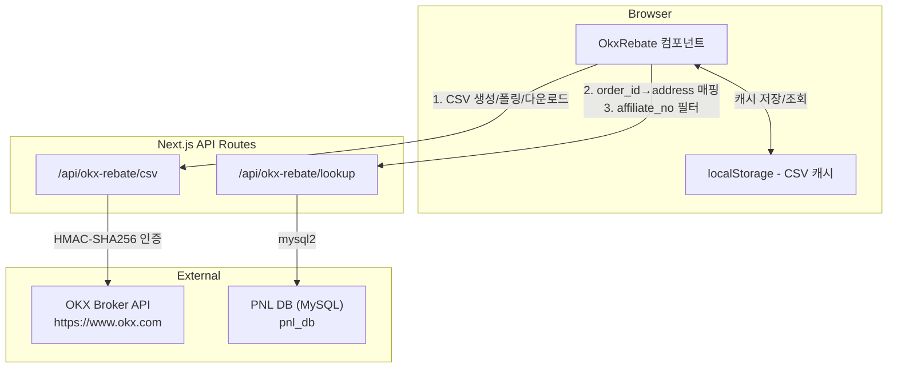
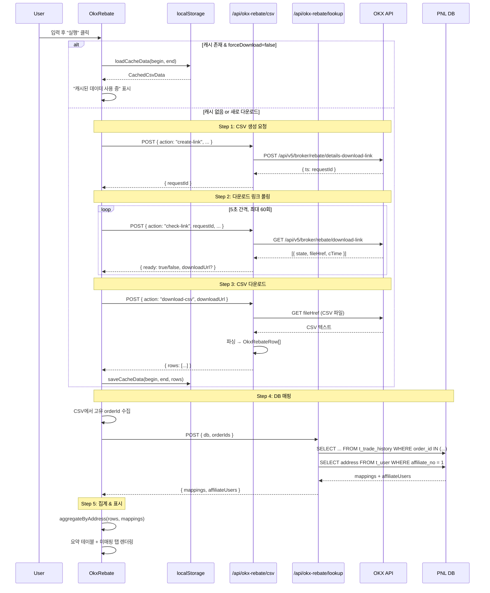

# 설계 문서: OKX 리베이트 조회

## 개요

OKX 브로커 프로그램에서 받은 리베이트 리워드를 조회하는 도구이다. OKX API를 통해 리베이트 상세 CSV를 다운로드하고, PNL DB와 매핑하여 주소별 리베이트 현황을 분석한다.

핵심 설계 원칙:

- **서버 프록시 방식**: OKX API는 CORS 제한이 있으므로 Next.js API Route를 통해 서버에서 호출. DB 쿼리도 서버 사이드
- **클라이언트 집계**: CSV 파싱, 주소별 집계, 필터링, 정렬 등 데이터 가공은 클라이언트에서 수행
- **단계별 상태 머신**: OKX CSV 다운로드는 Java 코드와 동일한 상태 머신 흐름 (요청 → 폴링 → 다운로드)
- **캐시 재사용**: 한 번 다운로드한 CSV 데이터를 localStorage에 캐싱하여 재조회 시 즉시 사용

---

## 아키텍처



기존 도구들과 동일한 패턴:

- `src/config/tools.ts`에 도구 등록
- `src/app/tools/[slug]/page.tsx`에서 slug 매핑
- 컴포넌트: `src/components/okx-rebate/` 하위
- 비즈니스 로직: `src/lib/okx-rebate/` 하위
- API 라우트: `src/app/api/okx-rebate/` 하위

---

## 컴포넌트 및 인터페이스

### 컴포넌트 구조

```
src/components/okx-rebate/
├── OkxRebate.tsx              # 메인 컨테이너 (상태 관리, 프로세스 오케스트레이션)
├── CredentialsForm.tsx        # OKX 인증 + PNL DB 접속 + 기간 입력 폼
├── ProgressSteps.tsx          # 단계별 진행 상태 표시
├── SummaryPanel.tsx           # 전체 합산 요약 카드
├── RebateTable.tsx            # 주소별 합산 요약 테이블 + 상세 펼침
├── UnmatchedTable.tsx         # 미매핑 주문 테이블
└── CacheManager.tsx           # 캐시 목록 관리 UI
```

### 컴포넌트 인터페이스

```typescript
// CredentialsForm: 입력 폼
interface CredentialsFormProps {
  onSubmit: (params: FetchParams) => void;
  disabled: boolean;
  cachedRanges: CachedRange[];           // 캐시된 기간 목록 (캐시 존재 시 안내용)
}

// ProgressSteps: 진행 상태 표시
interface ProgressStepsProps {
  steps: StepStatus[];
}

// SummaryPanel: 전체 합산 요약
interface SummaryPanelProps {
  summary: RebateSummary;
}

// RebateTable: 주소별 요약 + 상세
interface RebateTableProps {
  rows: AddressRebateSummary[];
  onExportCsv: () => void;
}

// UnmatchedTable: 미매핑 주문
interface UnmatchedTableProps {
  rows: UnmatchedOrder[];
  onExportCsv: () => void;
}

// CacheManager: 캐시 관리
interface CacheManagerProps {
  entries: CachedRange[];
  onDelete: (key: string) => void;
  onClearAll: () => void;
}
```

### 라이브러리 모듈 구조

```
src/lib/okx-rebate/
├── types.ts         # 타입 정의
├── csv-parser.ts    # OKX CSV 파싱
├── aggregator.ts    # 주소별 집계, 필터링
├── cache.ts         # localStorage 캐시 관리
└── constants.ts     # 상수 (OKX API URL 등)
```

---

## 데이터 모델

```typescript
// src/lib/okx-rebate/types.ts

/** 실행에 필요한 입력 파라미터 */
interface FetchParams {
  beginDate: string;               // "YYYY-MM-DD"
  endDate: string;                 // "YYYY-MM-DD"
  okx: {
    apiKey: string;
    apiSecret: string;
    apiPassphrase: string;
  };
  db: {
    host: string;
    port: number;
    user: string;
    password: string;
    database: string;
  };
  forceDownload: boolean;          // 캐시 무시하고 새로 다운로드
}

/** OKX CSV 한 행 (OkxRebateDetail.java 대응) */
interface OkxRebateRow {
  brokerCode: string;
  level: string;
  instId: string;                  // 종목 (예: "SOL-USDT-SWAP")
  orderId: string;
  spotTradeAmt: number;
  derivativeTradeAmt: number;
  fee: number;                     // 음수 (OKX 원본 값)
  brokerRebate: number;
  netFee: number;
  settlementFee: number;
  subBrokerRebate: number;
  userRebate: number;
  affiliated: boolean;
  ts: number;                      // Unix ms
}

/** DB 매핑 결과 — order_id → address */
interface OrderMapping {
  orderId: string;
  address: string | null;          // null이면 미매핑
  exchangeUid: string | null;
}

/** 주소별 집계 결과 */
interface AddressRebateSummary {
  address: string;
  totalRebate: number;             // brokerRebate 합산 (USDT)
  totalFee: number;                // fee 합산 (부호 반전, 양수, USDT)
  tradeCount: number;              // 거래 건수
  details: OkxRebateRow[];         // 해당 주소의 상세 내역
}

/** 미매핑 주문 */
interface UnmatchedOrder {
  orderId: string;
  instId: string;
  fee: number;
  brokerRebate: number;
  derivativeTradeAmt: number;
  ts: number;
}

/** 전체 요약 */
interface RebateSummary {
  totalRebate: number;             // 전체 리베이트 합계
  totalFee: number;                // 전체 수수료 합계
  totalTradeCount: number;         // 전체 거래 건수
  addressCount: number;            // 매핑된 고유 주소 수
  unmatchedCount: number;          // 미매핑 건수
  unmatchedRebate: number;         // 미매핑 리베이트 합계
}

/** 진행 단계 상태 */
type StepState = "pending" | "running" | "done" | "error";

interface StepStatus {
  label: string;
  state: StepState;
  detail?: string;                 // 진행 상세 (예: "폴링 3/60...")
}

/** localStorage 캐시 항목 */
interface CachedRange {
  key: string;                     // "okx-rebate-{beginDate}-{endDate}"
  beginDate: string;
  endDate: string;
  cachedAt: string;                // ISO 8601
  rowCount: number;
}

/** localStorage 캐시 데이터 */
interface CachedCsvData {
  meta: CachedRange;
  rows: OkxRebateRow[];
}
```

### localStorage 스키마

| 키 | 값 형식 | 설명 |
| --- | --- | --- |
| `okx-rebate-creds` | `{ okx: { apiKey }, db: { host, port, user, database } }` JSON | 민감 정보 제외한 입력값 |
| `okx-rebate-cache-index` | `CachedRange[]` JSON | 캐시된 기간 목록 인덱스 |
| `okx-rebate-{beginDate}-{endDate}` | `CachedCsvData` JSON | 기간별 CSV 캐시 데이터 |

민감 정보(password, apiSecret, apiPassphrase)는 저장하지 않는다.

---

## API 라우트 설계

### 1. `/api/okx-rebate/csv` — OKX CSV 다운로드 전 과정

OKX CSV 다운로드의 3단계를 하나의 API 라우트에서 `action` 파라미터로 분기한다.

```typescript
// src/app/api/okx-rebate/csv/route.ts

export async function POST(request: Request) {
  const body = await request.json();
  // body.action: "create-link" | "check-link" | "download-csv"
  // body.okx: { apiKey, apiSecret, apiPassphrase }
  // + action별 추가 파라미터
}
```

#### Action: `create-link`

OKX API `POST /api/v5/broker/rebate/details-download-link` 호출.

```typescript
// 요청
{
  action: "create-link",
  okx: { apiKey, apiSecret, apiPassphrase },
  beginDate: "2026-04-01",
  endDate: "2026-04-20"
}

// 응답
{ requestId: 1745193600000 }
```

#### Action: `check-link`

OKX API `GET /api/v5/broker/rebate/download-link` 호출하여 상태 확인.

```typescript
// 요청
{
  action: "check-link",
  okx: { apiKey, apiSecret, apiPassphrase },
  requestId: 1745193600000,
  beginDate: "2026-04-01",    // requestId 기준 날짜 또는 원래 요청 날짜
  endDate: "2026-04-23"       // 현재 UTC 날짜
}

// 응답 (준비 안 됨)
{ ready: false }

// 응답 (준비 완료)
{ ready: true, downloadUrl: "https://..." }
```

#### Action: `download-csv`

`downloadUrl`에서 CSV 파일을 다운로드하여 파싱 후 JSON 배열로 반환.

```typescript
// 요청
{
  action: "download-csv",
  downloadUrl: "https://..."
}

// 응답
{
  rows: [
    {
      brokerCode: "656204a3b0e9BCDE",
      level: "",
      instId: "SOL-USDT-SWAP",
      orderId: "2877198384625049600",
      spotTradeAmt: 0,
      derivativeTradeAmt: 24.68,
      fee: -0.004936,
      brokerRebate: 0.0019744,
      netFee: 0.004936,
      settlementFee: 0.004936,
      subBrokerRebate: 0,
      userRebate: 0,
      affiliated: false,
      ts: 1758250140000
    },
    ...
  ]
}
```

#### OKX API 인증 (HMAC-SHA256)

```typescript
// src/lib/okx-rebate/okx-auth.ts

function createOkxHeaders(
  apiKey: string,
  apiSecret: string,
  apiPassphrase: string,
  method: "GET" | "POST",
  requestPath: string,
  body?: string,
): Record<string, string> {
  const timestamp = new Date().toISOString();
  const prehash = timestamp + method + requestPath + (body || "");
  const signature = hmacSha256Base64(apiSecret, prehash);

  return {
    "OK-ACCESS-KEY": apiKey,
    "OK-ACCESS-SIGN": signature,
    "OK-ACCESS-TIMESTAMP": timestamp,
    "OK-ACCESS-PASSPHRASE": apiPassphrase,
    "Content-Type": "application/json",
  };
}
```

### 2. `/api/okx-rebate/lookup` — DB 매핑 조회

order_id 목록으로 t_trade_history에서 address를 조회하고, affiliate_no 필터용 t_user 데이터도 함께 반환.

```typescript
// src/app/api/okx-rebate/lookup/route.ts

export async function POST(request: Request) {
  const body = await request.json();
  // body.db: { host, port, user, password, database }
  // body.orderIds: string[]
}
```

```typescript
// 요청
{
  db: { host: "127.0.0.1", port: 3306, user: "root", password: "xxx", database: "pnl_db" },
  orderIds: ["2877198384625049600", "2877198384625049601", ...]
}

// 응답
{
  mappings: [
    { orderId: "2877198384625049600", address: "0xabc...", exchangeUid: "OKX_12345" },
    { orderId: "2877198384625049601", address: null, exchangeUid: null },
    ...
  ],
  affiliateUsers: ["0xabc...", "0xdef..."]    // affiliate_no = 1인 주소 목록
}
```

DB 쿼리:

```sql
-- order_id → address 매핑 (exchange_uid가 OKX_로 시작하는 것만)
SELECT order_id, address, exchange_uid
FROM t_trade_history
WHERE order_id IN (?, ?, ...) AND exchange_uid LIKE 'OKX_%'

-- affiliate_no = 1인 사용자 목록
SELECT address FROM t_user WHERE affiliate_no = 1
```

order_id가 수천 건일 수 있으므로, IN 절을 500건 단위 배치로 분할하여 쿼리한다.

---

## 핵심 로직

### CSV 파싱

```typescript
// src/lib/okx-rebate/csv-parser.ts

/**
 * OKX CSV 문자열을 파싱하여 OkxRebateRow[] 반환.
 * 첫 번째 행은 헤더로 건너뛴다.
 * CSV 컬럼 순서: BrokerCode,Level,InstId,OrderId,SpotTradeAmt,
 *   DerivativeTradeAmt,Fee,BrokerRebate,NetFee,SettlementFee,
 *   SubBrokerRebate,UserRebate,Affiliate,TS
 */
function parseCsv(csvText: string): OkxRebateRow[];
```

### 주소별 집계

```typescript
// src/lib/okx-rebate/aggregator.ts

/**
 * CSV 행과 매핑 데이터를 받아 주소별로 집계한다.
 * 
 * 1. CSV 각 행의 orderId를 mappings에서 address로 변환
 * 2. address가 null인 행은 unmatchedOrders로 분류
 * 3. address별로 rebate, fee, 건수를 합산
 */
function aggregateByAddress(
  rows: OkxRebateRow[],
  mappings: OrderMapping[],
): {
  addressSummaries: AddressRebateSummary[];
  unmatchedOrders: UnmatchedOrder[];
  summary: RebateSummary;
};

/**
 * affiliate_no=1 필터 적용.
 * affiliateUsers Set에 포함된 address만 남긴다.
 */
function filterByAffiliate(
  addressSummaries: AddressRebateSummary[],
  affiliateUsers: Set<string>,
): AddressRebateSummary[];

/**
 * 필터링된 결과로 요약을 재계산한다.
 */
function recalculateSummary(
  addressSummaries: AddressRebateSummary[],
  unmatchedOrders: UnmatchedOrder[],
): RebateSummary;
```

### 캐시 관리

```typescript
// src/lib/okx-rebate/cache.ts

const CACHE_INDEX_KEY = "okx-rebate-cache-index";
const CREDS_KEY = "okx-rebate-creds";

function getCacheKey(beginDate: string, endDate: string): string;
function loadCacheIndex(): CachedRange[];
function saveCacheData(beginDate: string, endDate: string, rows: OkxRebateRow[]): void;
function loadCacheData(beginDate: string, endDate: string): CachedCsvData | null;
function deleteCacheEntry(key: string): void;
function clearAllCache(): void;
function saveCredentials(creds: Partial<FetchParams>): void;
function loadCredentials(): Partial<FetchParams> | null;
```

### 전체 프로세스 흐름



---

## 에러 처리

| 에러 상황 | 처리 방식 |
| --- | --- |
| OKX API 인증 실패 (401) | "API 인증 실패. Key/Secret/Passphrase를 확인하세요." 에러 표시, 프로세스 중단 |
| OKX API 일반 에러 | OKX 응답의 `sMsg` 에러 메시지 표시, 프로세스 중단 |
| 다운로드 링크 폴링 타임아웃 (60회 초과) | "CSV 생성 대기 타임아웃 (5분 초과)" 에러 표시, 프로세스 중단 |
| CSV 다운로드 실패 | 네트워크 에러 메시지 표시, 프로세스 중단 |
| CSV 파싱 에러 (잘못된 형식) | "CSV 형식 오류" 에러 표시, 잘못된 행 번호 포함 |
| PNL DB 연결 실패 | "DB 연결 실패. 접속 정보와 VPN을 확인하세요." 에러 표시 |
| PNL DB 쿼리 실패 | DB 에러 메시지 표시 |
| localStorage 용량 초과 | "캐시 저장 실패. 기존 캐시를 삭제하세요." 경고 표시 (프로세스는 계속) |

모든 에러는 ProgressSteps에서 해당 단계를 `error` 상태로 표시하고 에러 메시지를 표시한다.

---

## 테스트 전략

### 단위 테스트

| 대상 | 검증 내용 |
| --- | --- |
| `csv-parser.ts` | CSV 파싱 정확성, 14개 컬럼 검증, 빈 값 처리, 헤더 스킵 |
| `aggregator.ts` | 주소별 집계 정확성, 미매핑 분류, affiliate 필터, 요약 재계산 |
| `cache.ts` | 캐시 저장/조회/삭제, 인덱스 관리 |
| OKX HMAC 서명 | 서명 생성 정확성 (알려진 입력/출력 쌍으로 검증) |
| 도구 등록 | tools 배열에 `okx-rebate` slug 존재 확인 |

### 속성 기반 테스트 (Property-Based Tests)

#### Property 1: CSV 파싱 왕복 정확성

_For any_ 유효한 14개 컬럼 CSV 행에 대해, `parseCsv`는 각 필드를 올바른 타입과 값으로 파싱해야 한다. 특히 `fee`는 음수, `ts`는 양의 정수여야 한다.

**Validates: Requirements 3.3**

#### Property 2: 주소별 집계 합산 보존

_For any_ OkxRebateRow 배열과 OrderMapping 배열에 대해, `aggregateByAddress`의 결과에서 모든 `addressSummaries`의 `tradeCount` 합 + `unmatchedOrders` 수 = 원본 CSV 행 수와 같아야 한다. 또한 모든 `addressSummaries`의 `totalRebate` 합 + 미매핑 `brokerRebate` 합 = 원본 CSV의 전체 `brokerRebate` 합과 같아야 한다.

**Validates: Requirements 5.2**

#### Property 3: affiliate 필터 부분 집합 보존

_For any_ AddressRebateSummary 배열과 affiliateUsers Set에 대해, `filterByAffiliate`의 결과는 원본의 부분 집합이어야 하며, 결과의 모든 address는 affiliateUsers에 포함되어야 한다.

**Validates: Requirements 7.3**

#### Property 4: 캐시 왕복

_For any_ 유효한 OkxRebateRow 배열과 날짜 범위에 대해, `saveCacheData` 후 `loadCacheData`는 원본과 동일한 데이터를 반환해야 한다.

**Validates: Requirements 4.1, 4.2**

#### Property 5: 정렬 안정성

_For any_ AddressRebateSummary 배열에 대해, 임의의 컬럼으로 정렬 후 해당 컬럼 값은 단조 증가(오름차순) 또는 단조 감소(내림차순)여야 한다.

**Validates: Requirements 6.1.3**
